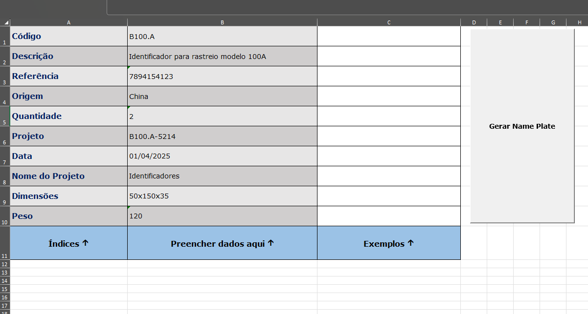
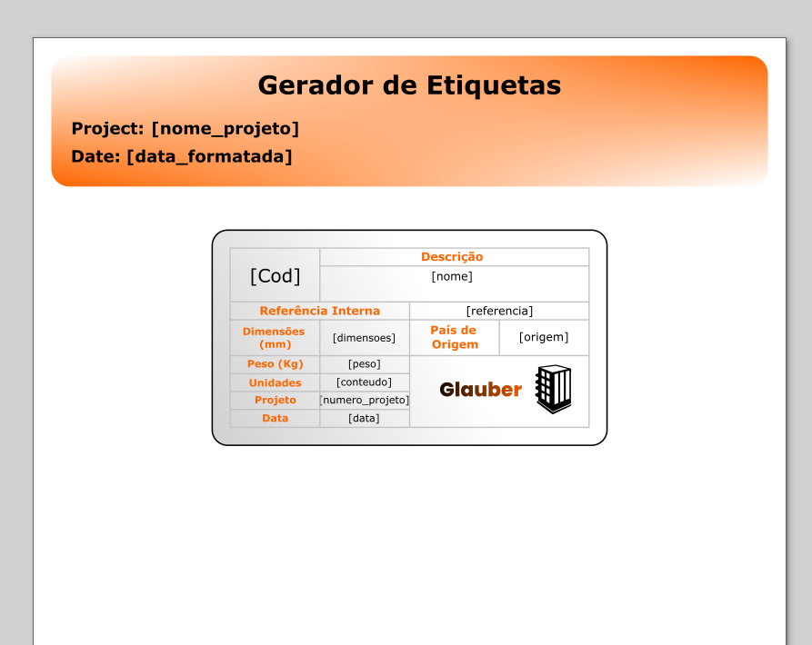
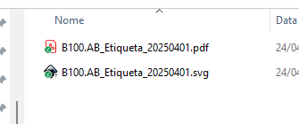
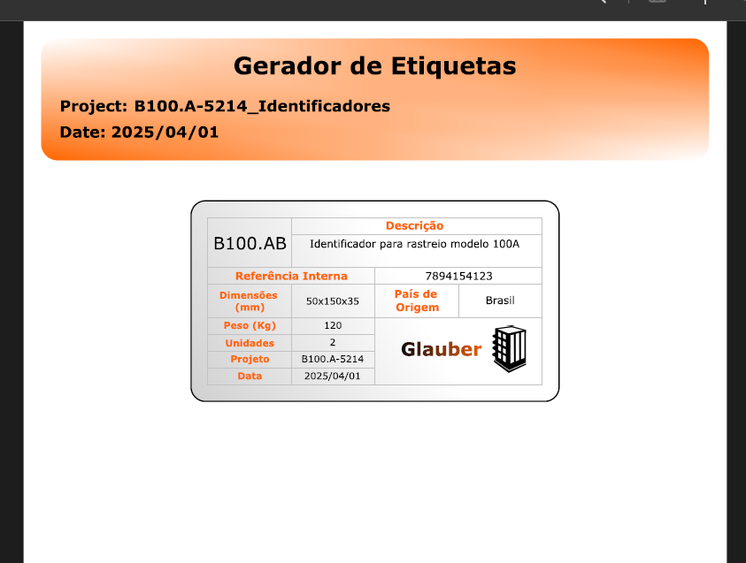

# 🖨️ Gerador de Cartão de Visita com Excel, VBA e Inkscape

Este projeto automatiza a geração de **cartões de visita personalizados** diretamente a partir de dados inseridos em uma planilha do Excel. Ao clicar em um botão, são criados automaticamente um **arquivo SVG** e um **PDF pronto para impressão**, com base em um template pré-definido no Inkscape.

---

## ✨ Visão Geral

O usuário preenche algumas células no Excel com informações como nome, código, data, dimensões, entre outros. Ao clicar no botão "Gerar", o Excel processa os dados, substitui campos no template SVG e aciona o Inkscape para exportar um PDF final.

---

## 🧰 Tecnologias Utilizadas

- **Microsoft Excel (VBA)** – Automação da leitura de dados, manipulação de arquivos e execução de comandos.
- **Inkscape CLI** – Utilizado para converter SVG em PDF.
- **SVG Template** – Arquivo base com campos substituíveis via VBA.

---

## ⚙️ Funcionalidades

- Preenchimento simples no Excel
- Geração automática de SVG e PDF
- Criação de pasta de saída com nome baseado nos dados
- Coloração dinâmica de campos vazios (ex: dimensões/peso em vermelho)
- Substituição de campos identificados no SVG por dados da planilha

---

## 🚀 Como Usar

1. Abra o arquivo `Cartao_Gerador.xlsm`
2. Preencha as células indicadas com suas informações
3. Clique no botão "Gerar Name Plate"
4. Os arquivos serão salvos automaticamente em uma nova pasta com o nome do projeto

> ⚠️ **Importante:** O Inkscape precisa estar instalado e com o caminho correto definido no VBA (`inkScapePath`). Ajuste conforme seu sistema.

---

## 🖼️ Capturas de Tela

| Preenchimento no Excel |
|------------------------|
|    |

| Template SVG do Inkscape |
|------------------------|
|    |

| Pasta Criada |
|------------------------|
|    |

| Arquivos Criados |
|------------------------|
|    |

| Arquivo PDF pronto |
|------------------------|
|    |

---

## 📌 Requisitos

- Microsoft Excel com macros habilitadas
- Inkscape instalado (versão com suporte à linha de comando)

---

## 📄 Código Fonte (VBA)

[📂 Clique aqui para ver o código VBA](https://github.com/GlauberCarlos/Gerador-Cartoes-VBA-Inkscape/blob/main/codigo.bas)

---

## 🎯 Objetivo

Esse projeto foi criado com propósito **educacional e experimental**, para explorar:

- Automação com VBA
- Manipulação dinâmica de arquivos SVG
- Integração com softwares externos (CLI)
- Processos de geração automatizada de documentos técnicos

---

## 📝 Nota

Este projeto foi desenvolvido com foco em aprendizado, e parte da lógica em VBA foi criada com o auxílio do ChatGPT, como apoio no processo de estudo e prática com automação de documentos.

